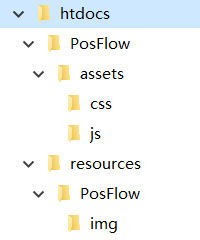
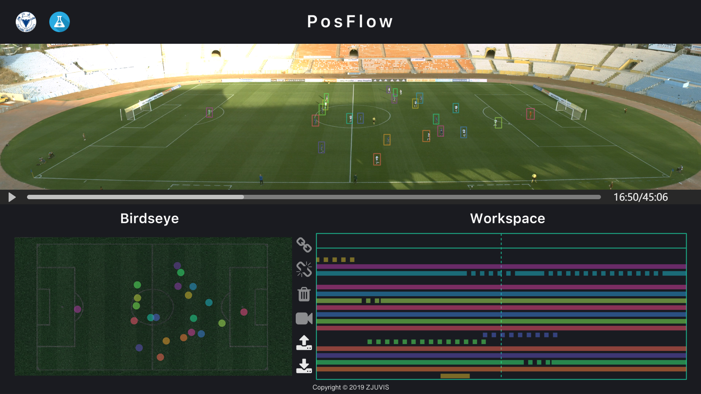

# PosFlow
A tool for merging tracklets of players in videos using d3

[TOC]

## Get Started

本系统使用d3.js在chrome浏览器下开发和测试. 由于d3.json方法要求服务器支持, 因此需要安装服务器后端作为支持, 建议使用Apache (IIS等其它服务器方式未测试). 若有任何问题请联系我们: forvis@zju.edu.cn

在 release 里可以看到我们demo用的 tracklet ,图片 和视频文件, 下载解压到服务器根目录即可

即 形成文件结构形如(以Apache服务器的htdocs为根目录为例)

## 界面说明

### 布局简介

该系统主要分为三个部分, Monitor(主视图), Birdseye(鸟瞰视图), Workspace(工作区), 三个部分的tracklet数据共享. (一个tracklet代指一个球员在一段时间内的追踪结果的集合)

- Monitor 主视图
  - 视频窗口与控制组件
  - 与tracklet对应的矩形
  - 球员脚下的path(轨迹)
- Birdseye 鸟瞰视图
  - 由相机视角计算得到的鸟瞰投影视角
  - 与tracklet对应的圆形
  - 球员移动的path(轨迹)
- Workspace 工作区
  - 中央按钮
  - 所有tracklet (中间绿色虚线代表当前时刻, 横轴为时间线, 包含前后五秒)
  - 选择区 (右边大矩形当中靠上方的实线小矩形)
  - 待选区 (右边大矩形当中靠下方的实线大矩形)

Tracklet的四种状态

- 可选择: 表现为较低不透明度的彩色
- 悬浮: 表现为高于 "可选择" 不透明度的彩色, 且球员脚下/鸟瞰视图会出现路径
- 选中: 表现为不透明的彩色, 且球员脚下/鸟瞰视图会出现路径
- 不可选: 表现为灰色, 且鼠标悬浮时会表现为"禁止"样式

按钮的两种状态

- 可使用: 表现为不透明, 鼠标指针样式为手形
- 不可使用: 表现为较低不透明度, 鼠标指针样式为 "禁止"

实线与虚线

- Tracklet在数据结构上是由一帧一个的"box"所组成的数组
- 主视图中的实线框表示"由追踪算法得到的box", 工作区实线部分同理
- 主视图中的虚线框表示"由用户merge, 插值得到的box", 工作区虚线部分同理

## 操作指南

### 操作列表

- 中央按钮操作
  - **合并 Merge** 中央第一按钮 
  - **切分 Cut** 中央第二按钮
  - **删除 Delete** 中央第三按钮
  - **选择视频文件 Select Video** 中央第四按钮
  - **载入本地tracklet数据文件 load** 中央第五按钮
  - **下载tracklet数据文件到本地 save** 中央第六按钮
- 通用操作
  - **选择/取消选择** 单击
  - **预览轨迹** 鼠标悬浮
- 视频操作
  - **向后一帧** 键盘右键 ->
  - **向前一帧** 键盘左键 <-
  - **播放速度加快一倍** Ctrl + ->
  - **播放速度减慢一倍** Ctrl + <-
  - **更改当前播放时刻** 拖动/单击进度条
- Monitor 主视图操作
  - **放大缩小** 鼠标滚轮
  - **放大状态下移动当前窗口观察位置** 鼠标拖动
- Birdseye 鸟瞰视图操作
  - **连线** 双击某一球员以开始, 双击其他球员以连线, 可连续连接多个球员, 一条线连接完毕后按Ctrl + l (小写L)以结束
  - **取消连线** 双击已连线段
- Workspace 工作区操作
  - **查看所有tracklet** 鼠标滚轮

该系统的终极目标是将追踪同一球员的所有tracklet都merge到一起, 形成最终的22个tracklet, 在三个视图上, 同一段tracklet有三个不同的表现形式(主视图球员框 / 鸟瞰视图球员圆点 / 工作区矩形条) , 但是数据是共享的, 颜色是相同的.

### 基础操作流程

1. 合并流程
   1. 单击以选中tracklet, 选中之后, 与之时间上相冲突的tracklet将会变灰. 主视图和鸟瞰视图将会显示tracklet前后五秒的轨迹
   2. 当鼠标悬浮(hover)在tracklet上时, 高亮并预览轨迹
   3. 选中两条不冲突的tracklet之后, 单击中央第一按钮进行合并
      1. 说明: 为了防止由于时间差导致工作区内两个被选中tracklet无法同时显示, 被选中的tracklet即使不在10秒范围内出现也不会消失, 而是会"留"在选择区
2. 切分流程
   1. 单击以选中待切分的tracklet
   2. 使用鼠标或键盘更改当前播放位置, 使工作区虚线对齐需要切分的位置
      1. Hint: 使用键盘方向键左右进行精确控制
   3. 单击中央第二按钮进行切分
3. 删除流程与切分类似, 使用中央第三按钮(垃圾桶图标)进行删除
4. 选择视频文件
   1. 单击中央第四按钮, 在弹出的窗口中选择视频文件
5. load 加载本地tracklet数据
   1. 注意, 该操作会舍弃未保存的修改
   2. 单击中央第五按钮在弹出的窗口中选择tracklet数据文件(json格式)
6. save 保存tracklet数据到本地
   1. 单击中央第六按钮

***
有任何需要请联系我们 forvis@zju.edu.cn
